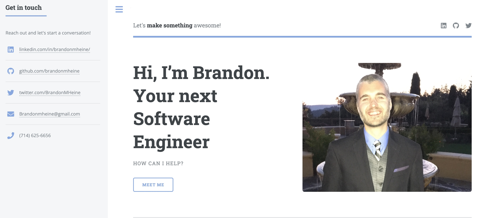

  <h1 align="center" style="color:blue;text-align:center;">Hi 👋, I'm Brandon Heine</h1>
  <h3 align="center">I am an experienced Software Engineer and Educator who loves coding, math, and rock climbing.</h3>
 

<h3 align="center">Connect with me:</h3>

  
  
  
  
  

  

<h1 align="center">Projects</h1>
<table bordercolor="#66b2b2">
  <tr>
    <td width="50%" valign="top">
      <h3 align="center">Portfolio Website</h3>
         
        
         
        
       
    
  
      

        
<strong>HTML5, CSS3, & Javascript</strong> - Portfolio Site including links to my projects and ways to get in contact with me.

    </td>  
    <td width="50%" valign="top">
      <h3 align="center">CRUD APP - "Goal Setter"</h3>
         
      
         
        
     
  
  
      

        
<strong>MongoDB Express.js React.js Node.js</strong> - Login to create, save, delete, and update your goals.

    </td>
  </tr>  
  <tr>
    <td width="50%" valign="top">
      <h3 align="center">Virtual Reading List</h3>
       
        
       
        

  
  
      

        
<strong>HTML5, CSS3, & Javascript</strong> - Track all of the books that you've read and want to read.

    </td>
    <td width="50%" valign="top">
      <h3 align="center">Restaurant Website</h3>
         
        
         
        
        
  
  
      

        
<strong>HTML5, CSS3, & Javascript</strong> - Interactive restaurant website with menu and reviews

    </td>
  </tr>
</table>

<h3 align="center">Languages and Tools:</h3>

    
  
    
    
    
    
    
    
    
    
    
    
    
    
    

